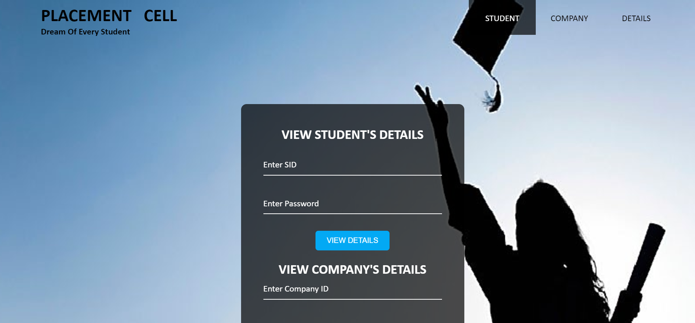
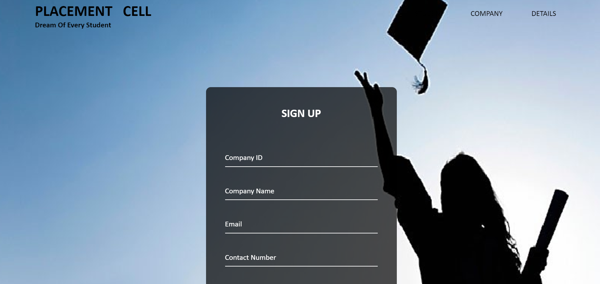
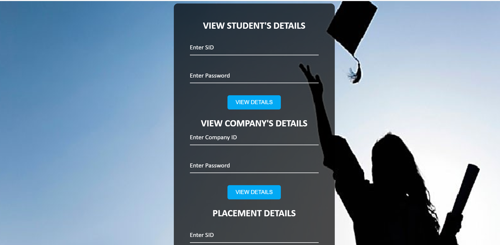

                
                            PLACEMENT CELL 
                        DREAM OF EVERY STUDENT
It is basically a Student Company Management System made using HTML , CSS, Java Scr ipt, CGI Scripting,  Ajax, Pymysql etc.

It Broadly consists of 3 Webpages:

1-> Student Login Page

    Where each student of the college has to register giving some of his details like SID, CGPA, Mobile 
    Number, Father's Name etc. that are essential to maintain a record of an individual.
    
       
2-> Company Login Page

    Where every company that comes into college for placements and internships has to give certain
    records like Company's Address, Company ID , Required CGPA, 10 or 12th marks if required etc.
    All these details will be taken and accordingly a list of eligible students for company would be
     prepared through which it can select the candidates.
       
3-> Details Page

    Where students can login to view the company's for which they are eligible.
    Company can login to view the list of eligible candidates that surpass the eligible conditions set
    by the company.
    
          
To run the Project, follow the steps:

•	Download all the above-mentioned file.

•	Run the student.html webpage or company.html webpage.

•	Any of the above pages will lead you to the remaining 2 pages from that very location itself.

NOTE: Before using it you need to maintain a database as the database linked to this project was local.
                          
